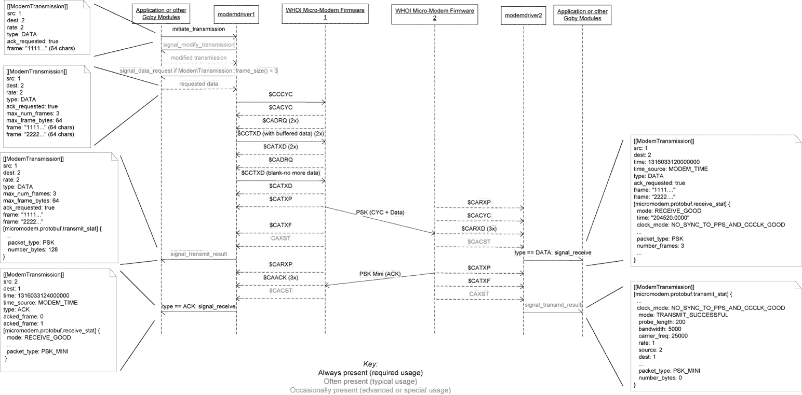
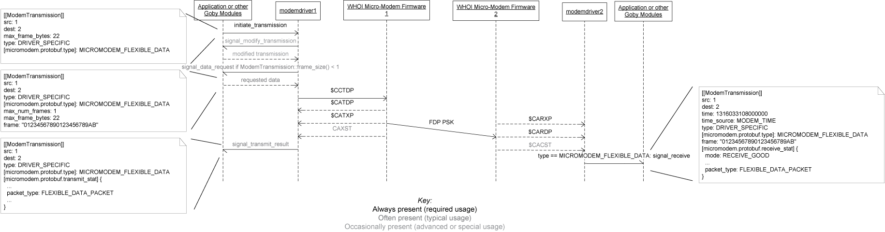

# Practical Session 1 & 2

Please perform the steps in Prep before starting either task.

This practical session has two separate components:

- Design a DCCL message
- Hands-on with the WHOI Micro-Modem

Since the second task requires access to the Micro-Modem hardware, one group will do this task in Practical Session 1 and the other group will do it in Session 2. The order in which these two components is done does not matter.

## Prep

I have provided a virtual machine (VM) based on Ubuntu 20.04 LTS for you to use for the rest of this course.

The VM can be downloaded on [Google Drive][VMdownload]. The VM can be used with any virtual machine software that can open OVA files. If you don't already have a preference, VirtualBox (<https://www.virtualbox.org/>) is a decent cross-platform choice. VMWare Workstation Player 16 also seems to work fine (though you'll need to click "Retry" when it gives you a warning about the OVA file).

[VMdownload]: https://drive.google.com/file/d/1uf5Ap1wfN1ejkPNv_bGMWaYVp_laDmN_/view


Once you have downloaded and installed your VM (File->Import Appliance on VirtualBox), boot it, and log in with:

 -  username: course
 -  password: dragon

Obviously, if you intend to put anything personal on this VM, please change the password.

The VM has a copy of Goby cloned to `/home/course/goby3`.

Please pull any changes since the VM was generated and build them:

```
cd ~/goby3
git checkout 3.0
git pull
./build.sh
```

The `goby3-course` repo contains all the code, launch files, and documentation specific to this course. Similarly, please update this and the related MOOS-IvP dependencies:

```
sudo apt-key adv --recv-key --keyserver keyserver.ubuntu.com 19478082E2F8D3FE
sudo apt update
sudo apt install libmoos-ivp-dev
cd ~/goby3-course
git fetch
git checkout nrl2021
./build.sh
```


## Design a DCCL message

Let's assume we have a CTD instrument on our AUV and we'd like to send samples of data from it via the acoustic modem.

To do so using Goby, the first step is to design a DCCL message for these data.

### Protobuf Message

First, start by defining a basic Protobuf message with the fields we want to send:

- Time
- Latitude
- Longitude
- Salinity
- Temperature
- Depth

Let's assume initially that these are all singular fields (`required`).

### Turning the message into a DCCL message

Using the lecture slides and the DCCL webpage (https://libdccl.org/) as a reference, turn the Protobuf message into a DCCL message by adding the appropriate bounds and metadata.

- You can use message ID 128 in the private/testing address space (see https://github.com/GobySoft/goby/wiki/DcclIdTable).
- Assume salinity from 25-40 (dimensionless, PSS), temperature from 0-30 degrees C, and depth from 0-200 meters for our vehicle. Assume latitude/longitude that covers the entire planet, and use the 'dccl.time2' codec for the timestamp (which, by default, compactly encodes the time to second precision assuming the message is received within 12 hours of transmission).
- Add your message to `goby3-course/src/lib/messages` (and to the `CMakeLists.txt` in that directory) and ensure that it compiles.

#### Questions

- How large is your message (using `dccl --analyze`)?
- Do you have any ideas for how to more compactly represent multiple samples within a single message?


## Hands-on with the WHOI Micro-Modem

This task is intended to familiarize you with the WHOI Micro-Modem and the Goby3 ModemDriver implementation for it.

We will be using actual Micro-Modems (as part of the GobySoft [NETSIM](https://gobysoft.org/doc/netsim/html/) setup) but instead of having amplifiers and transducers, the transmitted signals will be fed directly into the receivers. NETSIM allows for more complex modeling of the propagation but we will not be using that in this course for the sake of time.

### Connecting to NETSIM

The WHOI Micro-Modem has a serial interface based around NMEA-0183. When using NETSIM, this serial interface is forwarded over a TCP connection.

First you need to connect to the NETSIM VPN:

```
sudo openvpn netsim.conf
```

Make sure you can ping the NETSIM `audioserver` through the VPN by using:

```
ping 172.19.21.10
```

The 4 NETSIM Micro-Modems are served on TCP ports 62000-62003. To more accurately represent how these modems would be connected to a vehicle, we will use `socat` to connect to the NETSIM TCP and then provide the serial feed on a pseudoterminal (aka `pty`, as a virtual serial port):


This script will connect all four modems to virtual serial ports `/tmp/ttymm*` (real serial ports are often `/dev/ttyS*` or `/dev/ttyUSB*` but these will act much the same way)

```
cd goby3-course/scripts
./netsim_pty.sh
```

### Connecting to the Modems

Now you can use your terminal emulator of choice to connect to these virtual serial ports, just as if the modems were directly connected to your computer over serial.

I prefer `picocom` but `minicom` is also used by many and is a perfectly fine alternative. If not installed, run:

```
sudo apt install picocom
```

The WHOI Micro-Modem defaults to 19200 baud, so connect to the first modem (modem 0) with:

```
picocom /tmp/ttymm0 -b 19200
```

and the second modem (in a new terminal window or tab):

```
picocom /tmp/ttymm1 -b 19200
```

After a few seconds you will likely see the `$CAREV` message, which is the Micro-Modem version message that is by default regularly printed to the screen:

```
$CAREV,181807,AUV,2.0.27087*12
$CAREV,181807,COPROC,0.20.0.56*45
```

At this point you may find it helpful to download the "Micromodem2-Users-Guide" from WHOI: https://acomms.whoi.edu/micro-modem/software-interface/

### Micro-Modem Configuration

The Micro-Modem is configured using "NVRAM" parameters using the `$CCCFG` command (NMEA sentences to the modem are prefixed using ID "CC", and those from the modem are prefixed with "CA"). You can send messages by directly typing into the `picocom` window, but this is tricky to do accurately, so I prefer to use `printf` in a different terminal window. For example, to set the modem source address (often referred to as "modem ID" in Goby), you can send (to set the modem connected to /tmp/ttymm0 as modem ID 1):

```bash
printf '$CCCFG,SRC,1\r\n' > /tmp/ttymm0
```

Similarly for modem ID 2:

```bash
printf '$CCCFG,SRC,2\r\n' > /tmp/ttymm1
```

To query a NVRAM configuration value you can always use `$CCCFQ,___`, e.g.:

```
printf '$CCCFQ,SRC\r\n' > /tmp/ttymm0
```

should now return 

```
$CACFG,SRC,1*33
```

### Micro-Modem Pinging

One quick way to test connectivity between modems is using the two-way ping, or `$CCMPC` message. Trying pinging modem 2 from modem 1:

```
printf '$CCMPC,1,2\r\n' > /tmp/ttymm0
```

You could receive a `$CAMPR` response after a short while.

#### Questions:

- What are the values in the $CAMPR message? What do they mean (referencing the MicroModem2 User Guide)
- What NMEA message(s) does modem 2 (`/tmp/ttymm1`) show upon being pinged? 


### Micro-Modem Data

The Micro-Modem transmits data in "packets" of one or more "frames" using a particular "rate" (which maps onto modulation and channel coding values). See the "Packets, Rates, Frames and Acknowledgement" section of the MicroModem2 User Guide for details. Rates 1, 4, and 5 are the recommended choices, and rate 1 is the most common I use when I need reliable (but low throughput) comms.

#### Traditional (`$CCCYC`)

The Micro-Modem supports two data modes: the traditional (Micro-Modem 1) data protocol that is initiated by the `$CCCYC` message, followed by a request for data (`$CADRQ`) at which point the application provides data using (`$CCTXD`), once for each "frame".

Using the Goby ModemDriver this sequence looks like (from https://goby.software/3.0/md_doc103_acomms-driver.html):



The number of commands and timing is too complicated to easily replicate on the command line manually.

These packets are a fixed length (of time in the water) per frame, even if you only send a partial frame.

#### Flexible Data Packet (`$CCTDP`)

The Flexible Data Packet (FDP) added in the MicroModem2 is somewhat easier to use than the traditional data packet, though arguably more complicated to understand. Rather than a fixed size, the FDP can be variable length (in bytes), and the length in the water (in time) is based off the actual length transmitted.

The FDP cannot be used together with the traditional data packet as the modulation header is different. So you need to choose one or the other for your modem network.

Let's try sending an FDP packet manually. First set the modulation header version to `1` (which is the FDP packet version):

```
printf '$CCCFG,psk.packet.mod_hdr_version,1\r\n' > /tmp/ttymm0
printf '$CCCFG,psk.packet.mod_hdr_version,1\r\n' > /tmp/ttymm1
```

Then you can send an FDP packet at rate 1 from Modem 1 to modem 2:

```
printf '$CCTDP,2,1,0,0,DEADBEEF\r\n' > /tmp/ttymm0
```

By default all Micro-Modem messages use ASCII-encoded hexadecimal representation.

You should see this message on /tmp/ttymm1 as a `$CARDP` message.


#### Questions:

- How many bytes are in a frame for each FDP packet for rate 1 and for rate 5?
- How does the FDP mini-packet differ from the full packet?

In Goby, this transaction sequence looks like (from https://goby.software/3.0/md_doc103_acomms-driver.html):



### Using the goby_test_mmdriver1 test to understand the modem

The `goby_test_mmdriver1` tool is used to either:

- Test the Goby ModemDriver given two known working modems
- Test two modems given a known functional Goby ModemDriver

We will use this tool for the latter purpose today, and to give some insight into the way the Goby ModemDriver interacts with the WHOI Micro-Modem.

- First, disconnect from the pty serial ports (CTRL+A CTRL+X if you're using `picocom`). Only one application can talk to each modem at a time.
- Run the test:

```bash
goby_test_mmdriver1 /tmp/ttymm0 /tmp/ttymm1 ~/mm-test-log.txt 2
```

The command line parameters are

```
goby_test_mmdriver1 serialport0 serialport1 [file to write] [mm version (1 or 2)]
```

This will write a log of all the transactions to  ~/mm-test-log.txt which you can look at after the test completes (hopefully successfully).

The following tests are run (tests 1, 2, 3 no longer run by default):

- Ping test (test 0)
- Rate 0 (FSK modulation) test using `$CCCYC` (traditional data) (test 4)
- Rate 2 (PSK modulation) test using `$CCCYC`  (test 5)
- Rate 1 (PSK modulation) test using the FDP (test 6)

The glog streams are as follows, which will help you decipher the log file:

- `test`: Start/end of a particular test
- `driver1` / `driver2`: Information from the test from either driver1 (for Micro-Modem 1) or driver2 (for Micro-Modem 2).
- `goby::acomms::modemdriver::out::1` / `goby::acomms::modemdriver::out::2`: Messages sent out to modem 1 and 2 (respectively)
- `goby::acomms::modemdriver::in::1` / `goby::acomms::modemdriver::in::1`: Messages sent in to the computer (Goby) from modem 1 and 2
- `serial: /tmp/ttymm0` / `serial: /tmp/ttymm1`: Serial feed between the modem and the computer (this is largely a duplicate of the `goby::acomms::modemdriver::in/out::*` feed).


#### Questions:

- Take a look at the data from the "Rate 2 test". What is the sequence of messages sent between the modem 1 and the driver 1 to initiate a transmission of data? Do you see how these values map onto the Goby `ModemTransmission` protobuf message? You will likely need to reference the MicroModem2 User Guide and perhaps the sequence diagrams at https://goby.software/3.0/md_doc103_acomms-driver.html.
- How does the acknowledgement from modem 2 get reported by the receiving modem (1)? How is this then reported using the ModemTransmission message?

### Wrap Up

You should now have a basic understanding of the WHOI Micro-Modem serial interface and how the Goby `ModemTransmission` message gets mapped onto this protocol.

When using `pAcommsHandler`, you won't directly interact with the ModemDriver layer (this connects to the Queue and MAC layer), but it useful to have an understanding of the Micro-Modem serial interface for debugging and analysis purposes, or for using it in non-standard ways.

